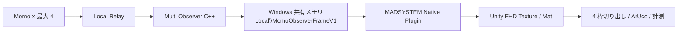

# MADSYSTEM Unity 連携実装ガイド

## 目的と前提

この文書は、Momo Multi Observer が Windows 共有メモリへ出力する合成フレームを、Unity の MADSYSTEM で取り込む実装者向けの契約である。

映像経路は次のとおりとする。OBS、仮想 WebCam、HDMI キャプチャーは使わない。これらを経由すると、余分な変換・バッファリングが入り、遅延とフレーム落ちの原因になる。



対象は同一 PC・同一 Windows ログオンセッションで動く 64 bit Windows Standalone の Unity アプリケーションである。`Local\\` 名前空間の共有メモリは別ユーザーセッションや Windows Service からは読めない。MADSYSTEM を Service 化する場合は、共有メモリ名と ACL を `Global\\` 用に設計し直す。

## 起動する Observer

Observer は 1 プロセスだけ起動する。同じ共有メモリ名で 2 つ目を起動すると、出力競合を避けるため Writer 側が失敗する。

```powershell
momo.exe --window-width 1920 --window-height 1080 --no-google-stun p2p-recv-multi `
  --source "11.3=ws://127.0.0.1:8090/ws?role=observer&device=11.3" `
  --source "11.4=ws://127.0.0.1:8090/ws?role=observer&device=11.4" `
  --source "11.5=ws://127.0.0.1:8090/ws?role=observer&device=11.5" `
  --flip-vertical --flip-horizontal
```

既定の共有メモリ名は `Local\\MomoObserverFrameV1` である。検証用に名前を変える場合だけ `--shared-frame-name Local\\別名` を指定する。

## 共有メモリ V1 契約

総サイズは `64 + 1,920 × 1,080 × 4 × 3 = 24,883,264 bytes`。先頭 64 bytes が Header、その後ろに同じ大きさの BGRA フレームが 3 枚並ぶ。

| offset | size | 型 | 内容 |
| ---: | ---: | --- | --- |
| 0 | 4 | `uint32` | magic: `0x3146504D` (`MFP1`) |
| 4 | 2 | `uint16` | version: `1` |
| 6 | 2 | `uint16` | header size: `64` |
| 8 | 4 | `uint32` | width: `1920` |
| 12 | 4 | `uint32` | height: `1080` |
| 16 | 4 | `uint32` | stride: `7680` bytes |
| 20 | 4 | `uint32` | pixel format: `0x41524742` (`BGRA`) |
| 24 | 4 | `uint32` | buffer count: `3` |
| 28 | 4 | `int32` | active buffer index: `0`〜`2` |
| 32 | 4 | `int32` | reserved |
| 36 | 4 | padding | 常に読み飛ばす |
| 40 | 8 | `int64` | sequence |
| 48 | 8 | `int64` | `timestamp_ns`。Windows system clock の epoch ns |
| 56 | 8 | bytes | reserved |

各フレームのサイズは `8,294,400 bytes`。`frameAddress = 64 + activeBuffer × 8,294,400` である。1 pixel はメモリ上で `B, G, R, A` の順に並ぶ。Unity の Texture は `TextureFormat.BGRA32` を使う。

## 完全フレームだけを読む

共有メモリを直接 `Texture2D` として参照してはいけない。Writer がコピー中のバッファを読むと、画面の上下で別フレームが混ざる。

1. `sequence` を読む。奇数なら Writer がコピー中なので再試行する。
2. `active_buffer` を読む。
3. 該当バッファ全体を Unity 用の所有メモリへコピーする。
4. `sequence` をもう一度読む。
5. 前後の値が同じ偶数なら採用する。不一致なら捨てて最大 2 回だけ再試行する。

古いフレームをキューへ貯めない。読めなければ直前の Texture を維持し、次の Unity Update で最新フレームを試す。計測系で重要なのは平均 fps ではなく、古い映像を処理しないことだ。

Native Plugin の最低限の C ABI は以下でよい。

```cpp
extern "C" {
  int MadsObserver_Open(const wchar_t* mapping_name);
  int MadsObserver_GetFrameInfo(FrameInfo* out_info);
  // dst は 1920 * 1080 * 4 bytes 以上。完全フレームを得た時だけ 1 を返す。
  int MadsObserver_CopyLatest(void* dst, size_t dst_size,
                              int64_t* out_sequence,
                              int64_t* out_timestamp_ns);
  void MadsObserver_Close();
}
```

`MadsObserver_CopyLatest` の内部で上記の sequence 再確認を完結させる。C# 側に Header の構造体やメモリバリアを持たせない。Unity の Mono／IL2CPP 差異を Plugin 内へ閉じ込めるためである。

## Unity 側の取り込み方針

最初の実装は CPU コピーで成立させる。`NativeArray<byte>` を確保し、Plugin がそこへ最新フレームをコピーし、`Texture2D.LoadRawTextureData` で FHD Texture を更新する。

```csharp
// 1 回だけ実行する。実際の Dll 名と CallingConvention は Plugin と合わせる。
[DllImport("MadsObserverBridge", CharSet = CharSet.Unicode)]
private static extern int MadsObserver_Open(string mappingName);

[DllImport("MadsObserverBridge")]
private static extern int MadsObserver_CopyLatest(
    IntPtr destination, UIntPtr destinationBytes,
    out long sequence, out long timestampNs);

// 初期化
var texture = new Texture2D(1920, 1080, TextureFormat.BGRA32, false, true);
var bytes = new NativeArray<byte>(1920 * 1080 * 4, Allocator.Persistent,
                                  NativeArrayOptions.UninitializedMemory);
MadsObserver_Open(@"Local\MomoObserverFrameV1");

// Update。Plugin が 1 を返したときだけ Texture を更新する。
if (MadsObserver_CopyLatest((IntPtr)NativeArrayUnsafeUtility.GetUnsafePtr(bytes),
                            (UIntPtr)bytes.Length,
                            out var sequence, out var timestampNs) == 1) {
    texture.LoadRawTextureData(bytes);
    texture.Apply(false, false);
}
```

上の断片は `NativeArrayUnsafeUtility` を使うため、Assembly Definition で `Unity.Collections.LowLevel.Unsafe` を許可する。安全な初期版を優先するなら、Plugin 側が `byte[]` を受ける方式でもよい。ただし 50 fps では GC 生成を絶対に行わない。`byte[]`、`NativeArray`、`Texture2D`、`Mat` は起動時に 1 回だけ確保する。

`Texture2D.LoadRawTextureData` と `Apply` は CPU → GPU コピーを行う。ArUco を CPU の `Mat` で実行する限り、GPU Texture からの読み戻しも必要になる。最初からゼロコピーを狙うと実装だけが複雑になる。50 fps を計測して不足した時だけ、Plugin が `Texture2D.GetNativeTexturePtr()` の D3D11 Texture へ `UpdateSubresource` する第 2 段階へ進む。

## FHD Mat と 4 枠の切り出し

Unity／OpenCV 側では、まず 1,920 × 1,080 の BGRA `Mat` を作る。その後、緑の余白を除いた `960 × 528` の ROI を使用する。スロットの割り当ては Observer 起動時の `--source` 順で固定される。

| index | device | ROI `(x, y, width, height)` |
| ---: | --- | --- |
| 0 | 11.3 | `(0, 6, 960, 528)` |
| 1 | 11.4 | `(960, 6, 960, 528)` |
| 2 | 11.5 | `(0, 546, 960, 528)` |
| 3 | 4 台目 | `(960, 546, 960, 528)` |

OpenCV では ROI をコピーせず、親 Mat の view として扱う。

```csharp
var slot113 = new Mat(fullBgraMat, new OpenCVForUnity.CoreModule.Rect(0, 6, 960, 528));
var slot114 = new Mat(fullBgraMat, new OpenCVForUnity.CoreModule.Rect(960, 6, 960, 528));
var slot115 = new Mat(fullBgraMat, new OpenCVForUnity.CoreModule.Rect(0, 546, 960, 528));
var slot4   = new Mat(fullBgraMat, new OpenCVForUnity.CoreModule.Rect(960, 546, 960, 528));
```

Observer は `--flip-vertical --flip-horizontal` を指定している。Unity Texture と OpenCV `Mat` の座標原点は混同しやすい。実装初日に、四隅へ番号を置いたテスト画像と ArUco Marker で、上・下・左・右が一致するかを実機で確認する。見た目だけでさらに `flip` を加えると、マーカー座標系が反転する。

## 映像停止の扱い

V1 Header は合成フレーム全体の sequence しか持たない。したがって、同じ静止画を再合成しているのか、実際に静止物を撮影しているのかを Unity 単独で判定できない。緑色判定を停止検知に使うのも誤りである。

機体単位の停止検知と復旧は、別途 Relay／Watchdog が持つ次の時刻で行う。

- Momo: camera frame、encoded frame、sent frame の最終増分時刻
- Relay: source ごとの最終 RTP 時刻
- Observer: source ごとの最終 decoded frame 時刻

Unity は `timestamp_ns` と Plugin が返す `sequence` を記録し、合成出力そのものが止まったことだけを検出する。機体ごとの異常状態は Watchdog API で受ける。将来 Header を V2 にするときは、各スロットの device id、接続状態、最終 decoded timestamp を追加する。

## 受け入れ試験

1. Unity が Header の magic、version、解像度、stride を検証してから開始する。
2. 3 台の映像が指定 ROI に入り、緑の 6 pixel 余白を含まない。
3. 4 台目が未接続でも、他の ROI 座標は動かない。
4. `sequence` 差分から、Unity 側で取得できた fps と Observer の公開 fps を別々に記録する。
5. 1 台の Momo を停止し、他 3 台の Texture 更新・ArUco 処理が継続することを確認する。
6. 4 台で 50 fps を目標に CPU 使用率、GC Alloc、Texture 更新時間、ArUco 処理時間、総遅延を記録する。

この段階で WebCam、OBS、HDMI Capture を混ぜない。経路が増えると、映像停止と計測遅延の責任箇所を追えなくなる。
