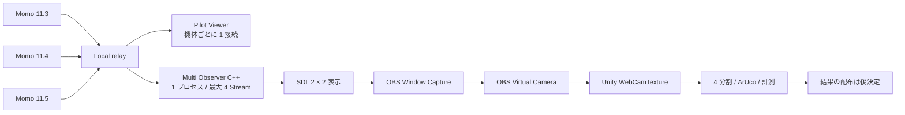
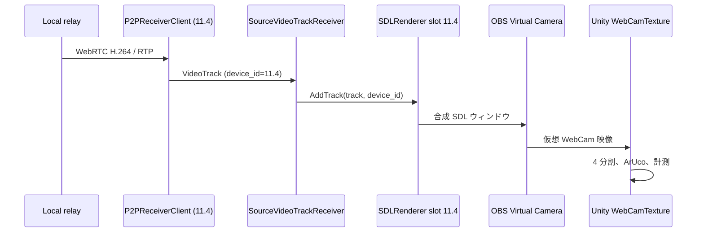

# 複数 Momo 合成 Observer 設計

> 現行の Unity 連携は OBS Virtual Camera を採用しない。Observer が出力する Windows 共有メモリを Unity Native Plugin で直接読む。実装契約は [MADSYSTEM Unity 連携実装ガイド](MADSYSTEM_UNITY_SHARED_MEMORY_GUIDE.md) を正とする。この文書内の OBS／WebCam に関する記述は初期検討時の案であり、現行構成には適用しない。

## 目的

ローカル relay を経由して最大 4 台の Momo 映像を 1 つの C++ Observer アプリケーションで受信し、1 つの SDL ウィンドウに固定 2 × 2 で合成表示する。その合成映像を Windows の仮想 WebCam として Unity に渡す。

この段階では C++ 側で OpenCV / ArUco の認識、計測結果の送信、座標変換は実施しない。認識と計測は Unity 側で合成映像を 4 分割してから行う。

対象機体の例は `11.3`、`11.4`、`11.5`、予備 1 台とする。Pilot 用 Viewer と Observer は relay の同じ映像を別々に受信する。

## 現状

- relay は `-source DEVICE=WS_URL` を複数指定できる。各 source は Momo へ WebRTC 接続を 1 本だけ張り、下流 Viewer へ分配する。
- `P2PReceiverClient` は 1 インスタンスにつき 1 つの WebSocket、PeerConnection、映像 Track を持つ。`P2PMultiReceiverClient` がこれを source ごとに生成する。
- `SDLRenderer` は複数の VideoTrack Sink を保持できる。Track 数に応じて表示枠を自動配置するため、4 Track の分割表示自体は既存の描画基盤で可能である。
- ArUco 検出器は SDL Sink ごとに生成できるが、この段階では有効化しない。
- 現行 `SDLRenderer` は Track の増減に応じて表示枠を詰める。Unity 側で枠を座標として使うには、接続断時にも枠位置を変えない固定スロットが必要である。

## 採用する構成



Observer は「1 機につき 1 アプリ」ではなく、1 プロセスで複数機を扱う。HDMI キャプチャーは使わない。Windows 内で OBS の仮想カメラを使い、Unity は通常の WebCam 入力として 1 枚の合成映像を受ける。

OBS の Virtual Camera は OBS の scene または source を WebCam を利用するアプリケーションへ出力できる。[OBS の公式ガイド](https://obsproject.com/kb/virtual-camera-guide) に従い、C++ の SDL ウィンドウを source として選ぶ。Unity は `WebCamTexture` でデバイス名を指定してカメラ入力を生成できるが、要求した解像度と FPS は利用可能な近い値になるため、実機で実測する。[Unity の WebCamTexture API](https://docs.unity3d.com/jp/current/ScriptReference/WebCamTexture-ctor.html)

Windows の Media Foundation Virtual Camera API を C++ へ直接実装する案は後回しにする。この API は Windows 11 で利用できるが、仮想カメラの登録・Media Foundation の source 実装・配布を自前で管理する必要がある。[Microsoft の API リファレンス](https://learn.microsoft.com/en-us/windows/win32/api/mfvirtualcamera/) 第 1 段階に入れる理由はない。

## 起動インターフェース

既存の単一機コマンドは残す。複数機用には新しい `p2p-recv-multi` サブコマンドを追加する。

```powershell
momo.exe p2p-recv-multi `
  --source "11.3=ws://127.0.0.1:8090/ws?role=observer&device=11.3" `
  --source "11.4=ws://127.0.0.1:8090/ws?role=observer&device=11.4" `
  --source "11.5=ws://127.0.0.1:8090/ws?role=observer&device=11.5" `
  --flip-vertical --flip-horizontal
```

- `--source` は 1 個から最大 4 個まで指定できる。
- `DEVICE` は relay の `-source` 名と一致させる。
- source ごとに接続失敗・再接続を独立して扱う。11.4 が未接続でも、11.3 と 11.5 の処理は継続する。
- 5 個目の source は起動時にエラーにする。

## コンポーネント設計

| コンポーネント | 責務 | 実装方針 |
| --- | --- | --- |
| `P2PMultiReceiverClient` | source 一覧の検証、各受信クライアントの生成・停止・再接続状態の集約 | 新規 |
| `P2PReceiverClient` | 1 source の WebSocket シグナリング、PeerConnection、受信 Track | 既存を再利用し、source 専用 Track 受信先と切断通知を追加 |
| `RTCManager` | 共有 PeerConnectionFactory から source ごとの Connection を生成 | `CreateConnection` に source 専用 `VideoTrackReceiver` を渡せるよう拡張 |
| `SourceVideoTrackReceiver` | Track と `device_id` を対応付けて Renderer へ渡す | 新規 Adapter |
| `SDLRenderer` | 最大 4 Stream の固定スロット表示、機体 ID・FPS・接続状態の Overlay | 既存の複数 Sink 基盤を拡張 |
| `Composite Preview` | 1920 × 1080 / 50 fps を目標にした単一 SDL 描画面 | `SDLRenderer` の出力 |
| OBS Studio | SDL ウィンドウを capture し、仮想 WebCam として公開 | C++ の実装外、実行時依存 |
| Unity | 仮想 WebCam を 4 分割し、ArUco 認識と計測を行う | MADSYSTEM 側 |

## 映像の流れ



計測結果の形式、送信先、カメラ校正、マーカー実寸、座標系は Unity 側の処理を決める段階で扱う。この C++ 実装の入出力契約には含めない。

## 表示仕様

- 最大 4 枠を固定順で表示する。順序は `--source` の指定順とする。
- 1 台は全画面、2 台は左右、3・4 台は 2 × 2 とする。
- 各枠に `device_id`、映像 FPS、接続状態を重ねる。
- source が切断された枠は黒画面にし、他の枠を詰めない。接続復帰時に同じ位置へ戻す。
- `--flip-vertical` と `--flip-horizontal` は全 source に共通適用する。機体ごとに異なる反転が必要になった時点で `DEVICE` ごとの設定を追加する。

既存 `SDLRenderer` は Track の増減で表示枠を詰める。これは監視画面としては不適切であり、複数機モードでは固定スロットへ変更する。

## 仮想 WebCam 出力

- C++ Observer は 1920 × 1080、50 fps を目標に 2 × 2 の SDL 合成画面を描画する。各枠は 960 × 540 とし、960 × 528 の入力映像は枠内へ表示する。
- OBS の canvas と output を 1920 × 1080、50 fps に設定する。
- OBS は C++ の SDL ウィンドウだけを capture し、Virtual Camera の出力を開始する。
- Unity は `WebCamTexture.devices` から OBS の仮想カメラを選び、1920 × 1080、50 fps を要求する。
- Unity は出力を左上、右上、左下、右下の 4 領域へ固定分割する。source が切断されても領域の座標は変えない。

OBS を経由するため、C++ から Unity までには追加の capture / copy が入る。50 fps は実装上の目標であり、実測前に保証しない。

## 接続・障害時の扱い

- relay への WebSocket 接続、ICE 接続、映像受信を source 単位で状態管理する。
- 1 source の失敗でプロセス全体を終了しない。
- source 再接続後は古い Track を確実に `RemoveSink` し、同じ固定スロットへ新 Track を追加する。
- Observer は `momo-command` を作成しない。計測プロセスから機体へ操縦コマンドを送らない。
- DataChannel telemetry はこの段階では受信しない。

## 性能上の確認事項

4 台 × 960 × 528 × 50 fps では、H.264 デコードと 4 枠の描画が並行する。C++ 側で I420 → BGR 変換と ArUco 検出をしないため、先行設計より負荷は下がる。ただし OBS の capture と Unity の WebCam 入力が追加される。

実装を複雑にする前に、以下を source ごとに計測する。

- 受信 FPS と描画 FPS
- C++ の受信 FPS と合成描画 FPS
- OBS の出力 FPS
- Unity が取得した WebCamTexture の実解像度・実 FPS
- Momo 受信から Unity のテクスチャ更新までの遅延
- CPU 使用率、メモリ使用量、ドロップ数

50 fps を維持できない場合は、どの段階で低下したかを切り分ける。C++ 合成、OBS Virtual Camera、Unity WebCamTexture を個別に計測し、最初に詰まる箇所を特定する。古いフレームをキューに溜める方式は採用しない。

## 実装範囲

### 第 1 段階

- `p2p-recv-multi` と最大 4 source の接続管理
- 共有 SDL ウィンドウの固定スロット表示
- source ごとの FPS、接続状態、機体 ID の Overlay
- source ごとの再接続
- 既存 `p2p-recv` の動作維持
- OBS Virtual Camera から Unity WebCamTexture への取り込み検証

### 第 2 段階

- Unity 側の 4 分割、ArUco、計測実装
- 計測結果を管理サーバーまたは Pilot へ配る方式の決定と実装
- マーカー実寸と座標系を用いた計測仕様の確定
- source ごとの設定ファイル化

## レビューで決める事項

実装開始前に以下を決める。

1. OBS Studio を C++ Observer と Unity の間の仮想 WebCam Adapter として採用してよいか。
2. 1920 × 1080 / 50 fps を合成映像の目標仕様としてよいか。
3. Unity が OBS の仮想カメラを認識しない、または 50 fps を維持できない場合に、Windows Media Foundation のネイティブ仮想カメラ実装へ進むか。

## 受け入れ条件

- 1 プロセスで 2 source、次に 4 source を同時接続できる。
- 各 source が指定した固定枠に表示され、機体 ID を確認できる。
- 1 source の切断・再接続が他 source の表示を停止させない。
- OBS の仮想カメラを Unity が WebCam デバイスとして認識する。
- Unity が 4 領域を固定座標で取得できる。
- `p2p-recv` の単一機モードが従来どおり動く。
- 実機 4 source で C++、OBS、Unity の FPS と遅延を記録する。

## 実装状況

第 1 段階の C++ 実装は完了した。2 source / 4 source の実機接続、OBS Virtual Camera、Unity `WebCamTexture` の動作と FPS・遅延の計測は未実施である。
