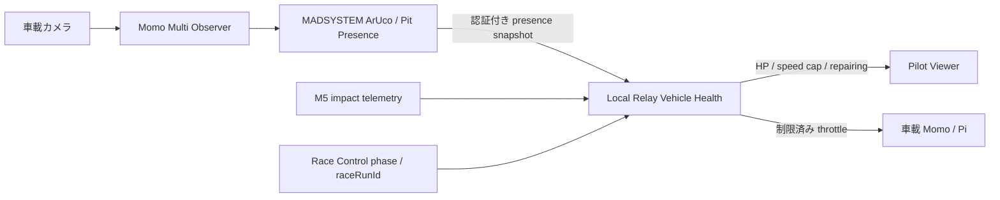

# ピットレーン・ダメージ回復 設計検討

## Status

- 状態: 実現可能性確認済み、未実装
- 対象: MADSYSTEM / Momo Multi Observer / Local Relay / Race Control / Relay Pilot Viewer
- 結論: 初期実装では MADSYSTEM がピット滞在を観測し、Local Relay が HP 回復を計算する

## 目的

ピットレーンに置いた専用 ArUco マーカーを車載カメラが捉えている間だけ、車体の HP を回復する。
F-ZERO のピットエリアに近い、走りながら利用できる回復ラインを想定する。

この文書では実装を行わず、現在の責務と経路に対して無理なく追加できる構成、暫定契約、検証条件を定める。

## 現状の確認結果

### 映像と ArUco

現在の経路は次のとおりである。

```text
車載 Momo x 最大4
  -> Local Relay
  -> Momo Multi Observer (4映像を2x2合成)
  -> Windows共有メモリ Local\MomoObserverFrameV1
  -> MADSYSTEM MomoObserverSharedFrameSource
  -> ArUcoWebCamMulti
```

`ArUcoWebCamMulti` は合成映像を4象限へ対応付け、フレーム全体で検出したマーカーを象限へ戻している。
したがって、各車載映像で見えたピットマーカーを `CP-1` から `CP-4` の固定枠へ対応させられる。
新しい映像経路や車載側ファーム変更は不要である。

既存のチェックポイント判定は、一定回数認識した後にマーカーが消えた時点で1回の通過として確定する。
ピット回復に必要な「見えている間」という状態とは意味が異なるため、既存の
`ReturnCheckPointFlag` を流用せず、独立した presence tracker を設ける必要がある。

### Observer

現在の Momo Multi Observer は映像の受信、2x2合成、共有メモリ出力、選択音声再生、診断表示を担当する。
レース状態や HP の正本ではなく、MADSYSTEM への映像入力を作るプロセスである。

Observer に ArUco と HP 管理を移す場合、Momo C++ 側への画像認識依存、状態管理 API、認証、再送、
テスト経路を新設する必要がある。一方、MADSYSTEM には既に OpenCV/ArUco、象限分離、replay入力がある。
初期段階で Observer へ移す利点は小さい。

### HP と走行ペナルティ

HP の正本は Local Relay の `tools/momo-relay/vehicle_health.go` にある。

- `strong` / `severe` の衝突イベントで HP を減算する
- HP から前進スロットル上限を計算し、Relay 境界で操縦指令へ適用する
- `VHS:1` を Pilot と Observer へ配信する
- race phase が `ready` へ変わった時に HP を100へ戻す

現在は、最後の衝突から4秒経過し、前進指令が継続している間に HP が自動回復する。
ピット回復モードを追加する際、この条件を残すとコース上でも回復するため仕様が成立しない。
旧条件は `legacy` として明示的に分離し、ピットモードでは無効にする必要がある。

## 推奨する責務

| コンポーネント | 初期実装の責務 | 持たせない責務 |
| --- | --- | --- |
| Momo Multi Observer | 4映像の受信、合成、共有メモリ出力 | ArUco判定、HP計算、回復時間計算 |
| MADSYSTEM | 専用マーカー検出、象限から`carId`への変換、presenceの安定化と送信 | HPの加減算、速度上限の決定 |
| Local Relay | HP正本、衝突減算、pit lease、回復積算、速度制限、Viewer配信 | 画像認識 |
| Race Control | 既存のrun/phase/timing管理 | 初期PoCのHP計算、pit heartbeat中継 |
| Pilot Viewer | HPと回復中表示 | 回復判定、HP正本、速度制限 |

この分担なら、ブラウザを改変した Pilot が HP や速度制限を回避できず、ArUco処理も既存の場所に留まる。

## 推奨データフロー



MADSYSTEM は「見えた」という観測だけを送る。回復量は送らず、Relay が自身の単調時計で積算する。
これにより送信側の停止、時計ずれ、重複送信で HP が余分に増えない。

## ArUco 設計

### マーカー辞書

現在の通常認識は `DICT_4X4_50` である。

- checkpoint は `EventManager.CheckPointNo` の可変ID
- bonus checkpoint は現行シーンで ID `49`
- pilot auto assign は ID `5..49` の2枚組を使う

したがって、空いて見える4x4 IDを無断でピット用へ割り当ててはならない。

初期PoCでは、ピット専用に別辞書の `DICT_5X5_50` を使う案を推奨する。
通常の4x4検出とは別の `ArucoDetector` を用意し、設定資産で dictionary と marker ID を固定する。
2回目の検出処理になるため、通常のラップ認識から独立した低い頻度で実行し、Unity ProfilerでCPU/GCを確認する。

代替案として `DICT_4X4_100` の ID `50` 以上を使う方法はあるが、既存4x4マーカーの互換性と誤り訂正性能を
実映像で確認するまでは採用しない。

### Presence tracker

各象限について次の状態を持つ。

```text
OUTSIDE -> ENTER_CANDIDATE -> ACTIVE -> EXIT_CANDIDATE -> OUTSIDE
```

- 単発検出だけでは `ACTIVE` にしない
- 複数フレームまたは一定時間の継続検出で enter を確定する
- 短い未検出はカメラ振動、遮蔽、圧縮ノイズとして許容する
- 未検出が猶予を超えたら exit を確定する
- 映像停止、象限無効、ArUco無効、race run変更では即時または短いTTLで fail closedする
- 検出面積や画面内位置は診断ログへ残すが、PoCではHP回復量へ使わない

既存の `RecogCount` / `Recognition_buffer` はチェックポイント通過用である。
ピット用の enter/exit閾値は独立設定にする。

## MADSYSTEM -> Relay 契約案

初期PoCは同一PC内の認証付きHTTPを推奨する。パスとフィールド名は実装開始時に固定する。
候補は `POST /api/v1/gameplay/pit-presence` である。

```json
{
  "schemaVersion": 1,
  "sourceId": "madsystem",
  "raceRunId": "rr_...",
  "sequence": 42,
  "cars": [
    { "carId": "CP-1", "present": true },
    { "carId": "CP-2", "present": false },
    { "carId": "CP-3", "present": false },
    { "carId": "CP-4", "present": false }
  ]
}
```

契約上の要点:

- 差分ではなく、構成されている全車の完全スナップショットを送る
- `sequence` はrun内で単調増加し、古い値をRelayが無視する
- `raceRunId` がRelayのactive runと一致しない値は回復に使わない
- `carId` は既存の固定枠 `CP-1..CP-4` を使い、device IDを使わない
- Relayは受信時刻をlease開始時刻として使い、MADSYSTEMの壁時計からHPを計算しない
- heartbeatがTTL内に来なければ全車 `present=false` として回復を止める
- 明示的な `present=false` はTTLを待たずに停止する
- endpointはloopbackまたは管理LANに制限し、Bearer tokenも要求する
- BrowserとObserverのWebRTC command channelはこの契約に使わない

MADSYSTEM と Relay が同一PCにある現行構成では、Race Controlをheartbeat中継へ追加するより変更範囲が小さい。
ただし token はコードやシーンへ固定せず、起動設定または秘密情報ストアから注入する。

## Relay の回復規則

Relay に回復モードを設ける。

| mode | 回復条件 |
| --- | --- |
| `legacy` | 現行の安全時間 + 前進指令。移行期間のみ使用 |
| `pit-marker` | active run、対象phase、かつ有効なpit presence lease |
| `disabled` | race中は回復しない |

`pit-marker` では次を守る。

- 回復量は `rate * Relay側の経過秒` で計算する
- 1回の更新で積算できる時間に上限を設け、停止復帰後の大量回復を防ぐ
- HPは `0..100` にclampする
- 衝突減算と回復を同じlock内で順序付ける
- `ready`、run変更、lease timeout、Relay再起動でpit presenceを破棄する
- RelayがMADSYSTEMとの通信を失った場合は回復しない
- 回復率は設定値とし、実走行のマーカー可視時間を測るまで固定仕様にしない

走行中に利用する回復ラインなので、初期仕様では停止やブレーキ入力を必須にしない。
必要なら後からスロットル上限、最低滞在時間、1周あたり回復上限を競技ルールとして追加する。

## Viewer と運営表示

現在の `VHS:1,<hp>,<speedCap>,<mode>` だけでも、HPバーが増えることで回復自体は表示できる。
回復中の発光や音を明示する場合は、後方互換を保って `VHS:2` 等に `repairing` を追加する。

Viewerは表示だけを行い、URLパラメーターやローカル状態からHPを増やさない。
Operations Dashboardには将来、次を読み取り専用で出すと診断しやすい。

- recovery mode
- pit presence active / lease age
- last accepted sequence
- HP / speed cap / repairing
- last marker enter / exit reason

## Race Controlへ移す判断条件

初期PoCではRace Controlを変更しない。次の要件が現れたら、HP正本をRace Controlまたは専用の
`Gameplay Judge`へ移す設計を再検討する。

- Relay再起動後もHPを維持したい
- HP、pit利用、衝突履歴を公式結果や実況へ含めたい
- 複数Relayや複数会場で同じ車体状態を共有したい
- 運営によるダメージ訂正、ペナルティ、手動回復を監査ログ付きで行いたい
- item、energy、boost等、HP以外のゲーム状態が増える

この場合も、映像合成プロセスであるMomo Multi Observerへ状態正本を持たせない。
名称の混同を避け、判定サービスは `Gameplay Judge` 等として分離する。

## 段階的な実装計画

### Phase 0: 記録映像で認識PoC

- 専用5x5マーカーを作成する
- 4象限のreplay映像でID、象限、面積、連続検出時間を記録する
- 通過速度、手ぶれ、逆光、斜視、短時間遮蔽でenter/exit閾値を決める
- 通常の4x4チェックポイント認識へのCPU/誤検出影響を測る

### Phase 1: MADSYSTEM presence tracker

- ArUco検出結果からチェックポイント処理とpit presence処理を分離する
- 純粋C# helperへ状態遷移を実装し、EditModeテストを追加する
- `quadrant -> carId` は既存の固定割当と同じ設定元を使う
- 送信を無効にしたローカルログモードで実機映像を確認する

### Phase 2: Relay pit leaseと回復

- 認証付きinternal endpointと全車snapshot契約を実装する
- `legacy|pit-marker|disabled` を追加する
- `pit-marker` では現行の前進中自動回復を無効にする
- stale sequence、run不一致、timeout、unknown carをfail closedで処理する
- 回復イベントを診断ログへ残す

### Phase 3: 結合とUI

- 4台同時で別車を回復しないことを確認する
- ViewerのHP増加、speed cap復帰、Drive Off、再接続を確認する
- 必要なら `repairing` 表示とOperations診断を追加する

## 必須テスト

### MADSYSTEM

- 1フレームだけ見えてもenterしない
- 継続検出でenterする
- 許容範囲内の欠落ではactiveを維持する
- 欠落猶予超過、映像停止、ArUco OFF、run変更でexitする
- 各象限が正しい `CP-1..CP-4` になる
- checkpoint/bonus/auto assignマーカーをpitと誤認しない

### Relay

- 有効なlease中だけHPが増える
- `legacy`回復が`pit-marker`で動かない
- timeout、stale sequence、raceRunId不一致で回復しない
- 衝突と回復が同時でもHPが範囲外にならない
- `ready`でHPを100へ戻し、pit leaseを破棄する
- 未認証、unknown car、不完全snapshotを拒否する
- Pilotが送る偽のpresenceを受理しない

### 実機

- 低速通過と想定最高通過速度で必要時間だけ回復する
- 隣接コースからマーカーが見えても回復しない配置にする
- 車体振動、映像圧縮、照明変化、部分遮蔽で誤回復しない
- 4台、30分以上でArUco処理、映像、操縦に回帰がない
- MADSYSTEM停止、Relay停止、ネットワーク断で回復が止まる

## 実装前に決める項目

1. ピット専用dictionaryとmarker ID
2. enter/exitの時間、heartbeat周期、Relay lease TTL
3. 1秒あたりの回復量と1回のピット通過で期待する回復量
4. 回復を許可するrace phaseとモード
5. Drive Offまたは停止中にも回復を許可するか
6. `VHS:1`のまま開始するか、`repairing`を含む新versionを同時導入するか
7. PoC後にRace Controlへ履歴を残す必要があるか

## 今回の判断

- 実現可能であり、現行のObserver共有映像と象限マッピングを利用できる
- ArUco判定は当面MADSYSTEMに置く
- HP計算と速度制限は当面Relayに置く
- ネイティブObserverへ画像認識とダメージ状態を移さない
- Race Controlは初期PoCでは変更しない
- 実装開始前に記録映像で専用マーカーとpresence閾値を確定する
