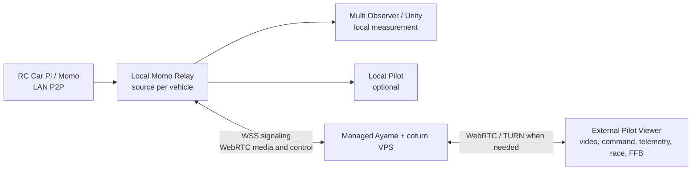

# Relay 経由 Ayame 外部 Pilot 設計

## 状態

Phase 1 と Phase 2 を実装・検証済み。Relay、Viewer、Pi/Momo、Ayame VPS の構成を定める。

外部 Pilot を有効にしても、ローカル 4 台の映像計測、Observer / Unity 連携、Relay の運用安定化、
および Pilot 側 FFB の実機調整を損なってはならない。

## 目的

会場 LAN 内の Raspberry Pi / Momo からの映像・操縦経路を Local Relay へ集約したまま、
外部ネットワーク上の Pilot だけを Ayame signaling と TURN 経由で接続できるようにする。

同時に、Multi Observer と Unity の計測受信は現状どおり Local Relay から継続する。外部 Pilot
の追加によって、Pi のカメラ、RC serial、または計測映像の経路を二重化しない。

## 採用構成

Ayame は signaling を担う。映像と DataChannel は可能な限り WebRTC の直接経路を使い、
NAT 越えに失敗した時だけ coturn を中継に使う。会場 LAN の Pi や Relay HTTP ポートを
インターネットへ公開しない。

Relay は Pi から受けた H.264 RTP を外部 Pilot 用 PeerConnection へ転送する。再エンコードは
行わない。従って、追加されるのは Relay での WebRTC 終端・再送とネットワーク hop であり、
映像デコード／再エンコードの遅延を増やさない。

## なぜ Pi から Ayame と Relay へ直接二重接続しないか

現行の Pi/Momo 運用は signaling mode を P2P または Ayame のどちらかに切り替える。Local Relay
は P2P source として Pi/Momo へ 1 本の WebRTC 接続を張り、下流へ分配する。

Pi で Ayame Pilot と Relay source を並列に持つには、同じカメラ・RC serial を使う複数の Momo
プロセス、または Momo 自体の multi-peer / media fan-out 拡張が必要になる。カメラ競合、操縦権の
二重化、障害時の停止経路の複雑化を招くため、この段階では採用しない。

## Relay の責務

### 上流: Pi/Momo

- source ごとに既存 P2P WebSocket / WebRTC 接続を 1 本だけ維持する。
- H.264 RTP と既存 `serial` DataChannel を受信する。
- source 単位の RTP 無音監視、PLI、再接続を維持する。

### 下流: Local Observer

- `role=observer` の既存経路を変更しない。
- Multi Observer の固定スロット、共有メモリ、Unity 計測を維持する。
- Observer は操縦 command を送らない。

### 下流: 外部 Pilot

- source ごとに Ayame room を 1 つ割り当てる。room 名は Race Control の car ID とは分離する。
- Relay 自身が Ayame の WebRTC peer になり、映像・command・telemetry・race を外部 Pilot へ配る。
- Pilot への送信 DataChannel 契約は Local Relay Pilot と同一にする。

| 方向 | DataChannel | 用途 |
| --- | --- | --- |
| Pilot -> Relay -> Pi | `momo-command` | RC 操作、Drive 状態 |
| Pi -> Relay -> Pilot | `momo-telemetry` | 車体 telemetry、状態 |
| Race Control -> Relay -> Pilot | `momo-race` | race state v2、順位、周回、flag |

外部 Pilot 用 Viewer は `signaling=ayame` であっても、Pi 直結 Ayame の `serial` 契約にはしない。
新しい `relay-ayame` 接続モードとして、Ayame signaling と Relay DataChannel 契約を組み合わせる。
FFB Bridge は従来どおり Pilot PC の localhost にのみ置く。

## 接続と認可

Ayame の room 参加可否と、RC 操作を許可することは別問題として扱う。signaling key だけで操縦を
許可してはならない。

- Relay source ごとに Pilot control lease を 1 件だけ持つ。
- lease を取得した外部 Pilot だけが `momo-command` を Pi へ転送できる。
- 同一 room の 2 人目は映像のみ、または明示的に reject する。初期実装は reject を採用する。
- Relay が切断、lease 失効、Pilot DataChannel 切断、または 250 ms の command deadman timeout を検知したら、Pi へ
  neutral を送る。Pilot Viewer は Drive Off 時にも neutral を送る。
- Race Master が lease の発行、失効、強制解除をできるようにする。初期段階では Relay 管理 API を
  直接公開せず、Race Control の認可済み操作からのみ制御する。
- Ayame signaling key、TURN credential、Viewer token は Git、URL の恒久クエリ、ログへ残さない。
  外部 Pilot ごとの短寿命 token を将来の標準とする。

## ネットワーク要件

- 管理中の Ayame / coturn VPS は TLS を持つ WSS endpoint を提供する。
- 会場 Relay から VPS への WSS 443 と、WebRTC の UDP / TCP TURN 経路を outbound で許可する。
- Pi、Relay の 8090、Observer、Unity、Race Control の会場 LAN endpoint は public inbound を持たない。
- 外部 Pilot の Viewer は HTTPS で配布する。FFB を使う Pilot は、Bridge の許可 origin を限定した
  ローカル配布 Viewer から開く。

## 遅延と品質

Relay は RTP を転送するため transcode はないが、Pi 直結 Ayame より Local Relay の 1 hop が増える。
外部操縦に進む前に、以下を source ごと・Pilot ごとに記録する。

- Pi -> Relay の最終 RTP 時刻、RTP 無音復旧回数、PLI 回数
- Relay -> Pilot の送信 fps、packet loss、RTCP RTT、keyframe 復旧時間
- Pilot の video frame age と DataChannel RTT
- command 送信から Pi 側 RC 出力までの往復確認値
- TURN 使用率、relay candidate 利用時の遅延、帯域、切断率
- Local Observer の fps と計測結果への影響

受け入れ判定は平均遅延ではなく、操縦中の最大 frame age、復旧時間、command 欠落、failsafe の確実性で行う。

## 段階導入

### Phase 0: 現行ローカル系の完了

- 2 台、4 台の Relay -> Multi Observer -> Unity を実機で計測する。
- RTP 無音検知、PLI、source 単位再接続を意図的な停止試験で確認する。
- Local Pilot の操縦、telemetry、Race Control、FFB を安定化する。
- この段階では Ayame / VPS の実装を変更しない。

### Phase 1: Relay の Ayame 下流接続（完了）

- Relay に source ごとの Ayame client を追加する。
- 1 source、1 Pilot、会場 LAN 内の試験端末で映像を検証する。
- RTP 転送、keyframe 要求、切断／再接続を Local Relay Pilot と同じ基準で確認する。

### Phase 2: `relay-ayame` Viewer（完了）

- Ayame signaling と `momo-command` / `momo-telemetry` / `momo-race` を組み合わせる `relayTransport=1` Viewer mode を追加する。
- Race HUD、telemetry 表示、neutral command の転送を確認する。外部 Pilot PC の FFB Bridge 実機確認は残る。
- Pi 直結 Ayame Viewer と Local Relay Pilot を回帰試験する。

### Phase 3: 認可と外部回線試験

- Pilot control lease、短寿命 token、Race Master の強制解除を実装する。
- TURN 強制経路を含め、別回線から操縦・切断・failsafe を試験する。
- 各 source の外部 Pilot は 1 名に制限し、Observer は別枠で維持できることを確認する。

## 受け入れ条件

- 外部 Pilot の接続有無にかかわらず、Local Relay -> Observer -> Unity の 4 台計測が継続する。
- 1 source に外部 Pilot を 1 名だけ接続でき、映像、操縦、telemetry、race state が揃う。
- 外部 Pilot の切断で、対象 source のみ neutral / Drive OFF となり、他 source と Observer を止めない。
- TURN 経由でも会場 LAN の public inbound を追加せずに接続できる。
- Pi 直結 Ayame、既存 Local Relay Pilot、FFB Bridge の運用を壊さない。
- 実機計測により、外部 Pilot の遅延・復旧時間・failsafe を記録し、運用可否を判断できる。

## 未決定事項

1. source と Ayame room の命名・発行を Race Control が持つか、Relay 設定が持つか。
2. 外部 Pilot を完全 reject のみとするか、映像専用 Observer を Ayame 側にも許可するか。
3. token 発行主体を Race Control、Relay、または専用 auth service のどれにするか。
4. VPS 上の Ayame / coturn の監視、credential rotation、障害通知をどこで運用するか。
