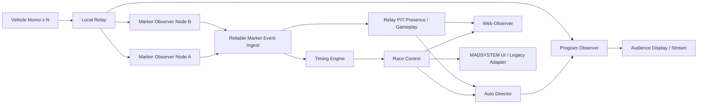
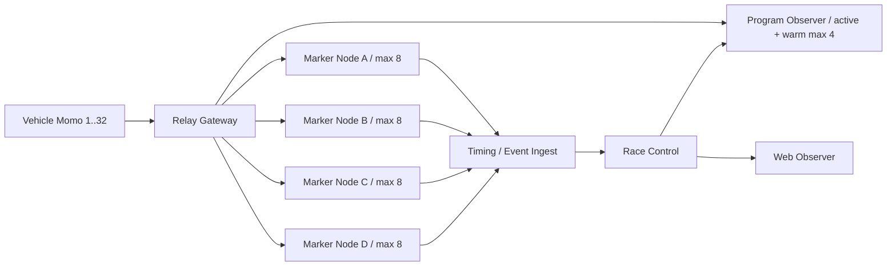

# Scalable Marker Observer and Program Observer Design

## Status

- 状態: legacy-adapter-implemented
- 実装: Relayの設定、診断、負荷・障害計測、Web Observer選択購読、実映像ArUco capacity測定、PyNvVideoCodec direct NVDEC比較、録画4入力のGPU Marker Observer producer、MADSYSTEM Legacy Adapterに加え、Native Observer Video Sinkのlive I420 Y平面バッチを実装。Reliable marker eventは未着手
- 対象: Momo Multi Observer / Local Relay / MADSYSTEM / Race Control / Web Observer
- 目的: マーカー検出を MADSYSTEM から独立させ、車両数を固定せずに追加できる構成と、観客向け映像を少数の注目車両へ切り替える構成を定義する

この文書を10台、20台運用へ向けた将来計画の正本とする。現行の最大4台、2x2合成、共有メモリ、
MADSYSTEM計測は維持しつつ、Relay側から段階的に固定台数前提を外す。
現行構成は [複数 Momo 合成 Observer 設計](MULTI_MOMO_OBSERVER_DESIGN.md) と
[MADSYSTEM Unity 連携実装ガイド](MADSYSTEM_UNITY_SHARED_MEMORY_GUIDE.md) を正とする。

## 背景

現行構成では、最大4台の映像を Momo Multi Observer が1920x1080の2x2映像へ合成し、
`Local\MomoObserverFrameV1`を通じて MADSYSTEM が取り込む。MADSYSTEM の
`ArUcoWebCamMulti`は合成フレームを4象限へ対応付け、全画面で1回実行したArUco検出結果を
各車両へ戻している。

4台では、1回の検出で4映像を処理できるため合理的である。一方、10台、20台へ拡張する場合は
次の制約がある。

- Multi Observer のsource数と表示レイアウトが最大4台に固定されている
- 2x2を5x4などへ広げると1車両あたりの画素数が減り、マーカー認識率が下がる
- 1車両あたりの解像度を維持すると合成フレーム、メモリコピー、描画負荷が増大する
- MADSYSTEM の象限、Timer、carId、Race Controlのstandings契約に固定台数の前提が残っている
- 計測に必要な全車映像と、観客が実際に見たい映像は一致しない

したがって、将来は「全車を対象にする検出系」と「選択した少数車両を見せる観客映像系」を
別コンポーネントとして扱う。

## 目標

1. 車両を固定配列へ追加せず、source登録によって1台ずつ増減できる。
2. マーカー検出のために全車映像を合成、描画、共有メモリ転送しない。
3. 1台の検出ノードの能力を超えた場合、別PCへsourceを分配できる。
4. 観客向けには、上位、接戦、PIT、重大イベントなどから選ばれた2から4台だけを映像化する。
5. MADSYSTEMから段階的に画像認識と計時責務を移し、現行運用を一度に置換しない。
6. Marker Observer、Program Observerのどちらも操縦用DataChannelを作成しない。

## スケール基盤の実装状況

2026-08-13時点で、次の5項目を既存計画へ統合した。初期実装は現行4台の既定動作を変えず、
台数を増やす前に測定と切り分けができる状態を作る。

| 項目 | 状態 | 現在の内容 | 次段階 |
| --- | --- | --- | --- |
| 1. 4/8/12/16/24/32台負荷試験 | 実測済み | 擬似Momo、WebRTC Viewer、Pilotを含むmatrixを自動実行し、32台まで測定した | 実機複数台と別PC間の長時間測定を行う |
| 2. 合格基準 | 暫定定義 | CPU、メモリ増加、source/streaming数、RTP age、ingress FPS、Race WS error、Telemetry dropを機械判定する | Pilot RTTとMarker検出遅延を測定項目へ追加する |
| 3. 接続単位の運用診断 | 実装 | Operations API v2に送信先host、role、client種別、transport、最終送出時刻、drop/errorを追加する | 接続履歴とアラート保持が必要か実運用で判断する |
| 4. Relay設定ファイル | 実装 | `-config relay-config.json`、`1..32`の安全上限、重複・未知項目・URLの厳格検証を追加する | active rosterとの照合と無停止reloadを別設計する |
| 5. 映像選択購読 | 初期実装 | Web Observerの`videoDevices`指定時だけ対象WebRTCを作る。未指定は従来どおり全台 | Race/Telemetryを映像接続から分離し、active + warm poolとDirector APIを実装する |

### 暫定合格基準

4、8、12、16 sourceをそれぞれ最低10分測定する。次の値は会場PCで最初の基準値を作るための暫定値で、
実測結果を保存した上で更新する。

| 指標 | 暫定合格値 |
| --- | --- |
| source / streaming数 | warmup後に対象台数を一度も下回らない |
| Relay CPU | 全論理CPU正規化のp95が60%以下 |
| Relay working set | warmup後の最大値と最小値の差が128MB以下 |
| streaming sourceのRTP age | 最大1000ms以下 |
| streaming sourceのingress FPS | 最小20 FPS以上 |
| Race WebSocket write error | 測定中の増加0 |
| Viewer Telemetry drop | 測定中の増加0 |

高台数で不合格になってもsource上限をコードだけで緩和しない。最後に安定合格した構成を
暫定node capacityとし、別RelayまたはMarker Observer Nodeへ分割する。

### 2026-08-13 実測結果

測定PCはCore i7-8700（6 core / 12 thread）、32GB RAM、Intel UHD 630、GeForce RTX 3060である。
Relay試験では擬似Momo 1台あたりH.264 RTP 30 FPS、8 packet/frame、1200 byte/packet
（約2.304 Mbps）とTelemetry 15 Hzを送った。擬似RTPは中継負荷用であり復号可能な映像ではない。

| Relay条件 | 時間 | 結果 | CPU p95 | 補足 |
| --- | ---: | --- | ---: | --- |
| 4/8/12/16/24/32 source、下流なし | 各30秒 | 全件合格 | 最大3.49% | 32台で上り約73.7 Mbps |
| 4/8/12/16/24/32 source、各Observer 1台 | 各30秒 | 全件合格 | 最大6.84% | 上りと下りを同時中継 |
| 32 source、各Observer 2台 | 60秒 | 合格 | 7.56% | 64 Viewer、下り約147 Mbps |
| 24 source、各Observer 1台、Pilot 1台、1 source切断 | 120秒 | 合格 | 6.33% | 3.43秒で復旧、他23台は継続 |
| 32 source、各Observer 1台、Pilot 1台、1 source切断 | 600秒 | 合格 | 6.46% | 3.44秒で復旧、他31台は継続 |

32台障害試験の初回だけ、強制切断対象とは別の2 sourceで約10秒の映像停止を観測した。同条件の
再試験と10分soak testは合格したため、現時点ではRelayの再現性ある不具合とは断定しない。ただし
32台を本番上限に採用する前に、実ネットワークと実機Momoで推奨1時間のsoak testを複数回行う。

Pilot共存試験は`sim-01`へ`momo-command`を50 Hzで送信し、`momo-drive`を開いた状態で実施した。
32台・600秒で30,200 commandを送信し、Telemetry dropとRace write errorは0だった。echoを持たないため
command RTTそのものは未測定であり、実車の適用時刻を返す診断契約は今後の課題とする。

ArUco試験には上下反転していた実走録画を180度回転し、H.264へ変換した入力を使用した。元映像は
960x528、50 FPS、VP9、SHA-256
`91A843493429A61C40E65474C829B60A83079C7DD0D63BCF8ABD7712D9E20E5D`で、marker ID 1、2、3を確認した。
検出はOpenCV 4.10、`DICT_4X4_50`、MADSYSTEMと同じ認識parameter、quality 0.6、25 Hzである。
50 FPS入力の2フレームに1回を処理し、検出時刻の量子化幅を最大40ms、平均約20msに抑える。
主要ID 1、2、3のほか、少数の17、30、37なども検出された。capacity計測では全IDを数えるが、
Marker Observer本体はactive courseのmarker allowlistと通過順、連続認識条件を満たすIDだけを
event化し、未知IDは診断カウンタへ残してrace eventには変換しない。

| 復号経路 | 25 Hzで合格した最大 | 最初の不合格 | 運用推奨 |
| --- | ---: | --- | ---: |
| OpenCV software | 6 source | 8 sourceでCPU p95 61.83% | 6 source/node |
| Intel QSV / VPL | 8 source | 10 sourceでCPU p95 66.12% | 8 source/node |
| NVIDIA NVDEC / CUDA | 8 source | 12 sourceでCPU p95 72.57% | 8 source/node |

同じ50 FPS入力を全フレーム認識する50 Hz比較試験も30秒で境界を確認した。合格条件は最低47.5 Hz、
検出latency p95 20 ms以下、process tree CPU p95 60%以下である。

| 復号経路 | 4 source | 5 source | 50 Hz候補上限 |
| --- | --- | --- | ---: |
| OpenCV software | 合格: 49.77 Hz、14.81 ms、CPU 53.38% | 未実施 | 4 source/node |
| Intel QSV / VPL | 合格: 49.49 Hz、17.63 ms、CPU 47.94% | 不合格: CPU 62.08% | 4 source/node |
| NVIDIA NVDEC / CUDA | 合格: 50.05 Hz、16.87 ms、CPU 48.80% | 不合格: 20.15 ms、CPU 68.01% | 4 source/node |

QSV/CUDAの6 sourceも49 Hz以上は維持したが、latency p95が21 msを超え、CPU p95が70%を超えた。
このPCでは50 Hzの短時間候補を4 source/nodeとし、本番上限へ採用する前に4 sourceの10分および
1時間試験を行う。25 Hzの8 source/nodeと50 Hzの4 source/nodeは別profileとして管理する。

物理限界と運用上限を分ける。CPU、温度、OS、Relay、ネットワークの余力を残すため、現PCでは
hardware decode時の`maxSourcesPerNode=8`、software fallback時は6とする。20台は8+6+6の3 node、
32台は8台×4 nodeを推奨する。QSV 8 sourceの10分soak testは最低復号・検出24.97 Hz、
検出latency p95 18.64ms、CPU p95 47.53%で合格した。別PCでは
[Scale Validation Runbook](SCALE_VALIDATION_RUNBOOK.md)に従って同じ入力と閾値で再測定する。
Relay 32台とArUco nodeは別々に測定しており、同一PCへ同居させる場合はend-to-end試験を別途行う。
現在のMomo Windows buildが公開するH.264 hardware decoderはIntel VPLであり、CUDA結果は将来の
Marker ObserverがFFmpeg/NVDEC経路を採用した場合の比較値である。現段階の試験は録画を独立processへ
入力したcapacity試験で、WebRTC受信からArUco eventまでのend-to-end保証ではない。

Ryzen 7 9700X、RTX 5070、64GB RAMの別PCでは、50 Hz direct NVDEC Phase 1を追加測定した。
NVIDIA PyNvVideoCodecを同一processで使用し、host NV12のY planeから既存CPU ArUcoへ渡した結果、
16 sourceが49.69 Hz、検出latency p95 9.04ms、CPU p95 59.62%で30秒合格した。17 sourceは
49.65 Hzを維持したがCPU p95 62.19%で不合格だった。これは短時間capacity境界であり、運用上限ではない。
運用候補12 sourceの10分soakは最低49.988 Hz、検出latency p95 7.971ms、CPU p95 44.531%、
最大working set 466.352MBで合格し、172秒の入力終端を複数回越えて再開した。同一frame indexの
1500 frame比較は、運用marker ID 1、2、3のframe-set一致率99.333%、全ID完全一致率98.2%だった。
ID 1、2、3の総検出回数と、3 frame以上継続した検出group数は一致した。isolatedな1 frame誤検出は
course allowlistだけでなく通過debounceでもevent化を防ぐ。direct NVDECの暫定運用候補は
12 source/nodeとするが、1時間soakとWebRTC受信からevent配信までのend-to-end試験後に確定する。
詳細は[GPU ArUco Implementation Plan](GPU_ARUCO_IMPLEMENTATION_PLAN.md)を参照する。

## 非目標

- Marker Observer、Timing Engine、Auto Directorの本実装を今回の基盤変更だけで開始すること
- 20台を1台のPCで処理できるという性能保証
- マーカー検出と同時にHP、順位、ラップを計算すること
- Relay本体へ画像復号やOpenCV処理を組み込むこと
- 全車映像を常時表示する監視画面の維持
- 映像から車両間の物理距離やライン取りを推定すること

## 目標構成



処理は次の3系統へ分離する。

| 系統 | 対象 | 主な出力 |
| --- | --- | --- |
| Detection Plane | 全車 | checkpoint / PITなどのmarker event |
| Race Data Plane | 全車 | 周回、順位、セクター、HP、PIT状態 |
| Program Video Plane | 選択した2から4台 | 観客向け映像 |

## 推奨配置

### 基本方針

Relayの中継とArUco検出を同じ上限で考えない。RelayはこのPCで32 source、Observer 32台、Pilot 1台を
10分処理できたが、25 Hz ArUco検出はhardware decodeでも8 source/nodeが運用上限だった。



- Relay Gatewayは映像を再encodeせず、接続・fan-out・Telemetry/Event中継と診断に限定する。
- Marker Nodeは1 node最大8 source、software fallbackでは6 sourceとし、担当を静的設定する。
- Race Control / Timingは映像を復号せず、確定eventとrace stateだけを扱う。
- Program Observerはactive + warmの最大4映像だけを復号し、全車を常時接続しない。
- MADSYSTEMをTiming Engineとして使う移行期間は、検出nodeと別PCに置く。
- 自動failoverは同一markerの二重確定対策が完成するまで行わず、standby nodeへ手動で再割当する。

### 台数別

| 車両数 | 推奨構成 | 備考 |
| ---: | --- | --- |
| 1から4 | 1 PCへRelay + 検出 + Race Controlを同居可能 | 開発・小規模向け。本番ではProgram出力を分離すると安定する |
| 5から8 | Relay/Race Control PC + Marker Node 1台 | 検出8台を上限とし、ProgramはRelay側または別PC |
| 9から16 | Relay Gateway 1台 + Marker Node 2台 + Control 1台 | nodeごとに最大8台。MADSYSTEMとProgramは負荷を見て分離 |
| 17から24 | Relay Gateway 1台 + Marker Node 3台 + Control 1台 + Program 1台 | 8台×3。運営表示と配信encodeを検出nodeへ置かない |
| 25から32 | Relay Gateway 1台 + Marker Node 4台 + Control 1台 + Program 1台 | 8台×4。検出node 1台停止時は担当8台だけinvalid化 |

20台なら8+6+6の3 Marker Node、32台なら8台×4 nodeを初期配置とする。CPU/GPUが新しいPCでも
測定なしにnode上限を増やさず、25 Hz suiteの最大合格台数から最低20%の余力を残して採用する。

### 集中サーバ形式

高性能な1台へRelay、複数Marker worker、Race Controlを集約する構成も可能だが、次の条件を全て満たす
場合だけ採用する。

- decoderごとに6から8 sourceのworker groupへ分け、1 process障害を全車障害にしない。
- 25 Hzのend-to-end試験でCPU p95 50%以下、GPU decoder使用率、温度、memory帯域を1時間維持する。
- OS更新、GPU driver停止、電源障害で全機能が止まるリスクを運用上許容できる。
- Program encode、録画、MADSYSTEM Unityのピークを含めて測る。
- NICは2.5GbE以上、NVMe、32台なら64GB以上のRAMを初期候補とする。

集中サーバは設置と管理が簡単だが、現行i7-8700 PCでは25 Hz検出が8台でCPU p95約40から49%に
達するため、20台以上の集中検出には採用しない。Relayだけを中央集約し、Marker Nodeを水平分割する
hybrid構成を標準とする。

### ネットワーク容量

今回の負荷条件は約2.304 Mbps/sourceで、32台のRelay上りは約73.7 Mbpsである。全32台を1組の
Marker Node群へfan-outするとRelay下りも約73.7 Mbps、同じ全車映像を2組へ出すと約147 Mbpsになる。
WebRTC、RTCP、音声、Telemetry、再送、Program映像の余裕を含め、1GbEを最低条件、20台以上は
2.5GbEを推奨する。車載Wi-Fi区間とRelay有線区間を同じ帯域評価に混ぜない。

## Marker Observer

### 責務

- Relayへread-only Observerとして車両source単位で接続する
- 復号済みWebRTCフレームからArUco markerを検出する
- marker IDをコース設定上の役割へ変換する
- 連続認識、消失猶予、通過確定、PIT entered / exitedをsource単位で管理する
- eventId、source sequence、発生時刻、診断値を含むイベントを送る
- 一時的な送信失敗に備えてbounded outboxから同一本文を再送する
- sourceごとの受信FPS、検出FPS、フレーム経過時間、drop数、検出遅延を公開する

### 持たせない責務

- ラップ、順位、タイム、ゴール判定
- HP増減、回復量、速度制限
- レース開始、終了、active runの決定
- 操縦信号の送受信
- 全車映像の合成と常時描画

### フレーム処理

Marker ObserverはSDL合成やBGRA共有フレームを経由せず、WebRTCのVideo Sinkでsourceごとの
復号済みフレームを直接受ける。可能な場合はI420のY平面をグレースケール入力として利用し、
色変換と全画面コピーを避ける。

2026-08-14のlive integrationでは、既存Native Observerのsource managerとdecoderを再利用し、
Video Sinkから固定4sourceの960x528 Y平面を`Local\MomoObserverLumaV1`へtriple bufferで公開する。
GPU workerは有効なY平面を1回のCUDA batchへ転送し、結果だけをLegacy Adapter IPCへ書く。
表示用`Local\MomoObserverFrameV1`も同じSinkから生成するため、MADSYSTEM表示とMarker認識がRelayへ
別々に接続・復号することはない。次の分離段階ではこの契約を保ったまま、Native nodeから
GPU detectorを直接呼び出すか、ローカルworkerを独立サービスとして維持するかを負荷と障害分離で決める。

各sourceの処理待ちフレームは最新1枚だけとする。検出処理が追い付かない場合は古いフレームを捨て、
キューを蓄積して検出時刻が遅れることを防ぐ。

初期値の候補は次のとおりとし、録画映像と実走で決定する。

- 映像受信: 現行sourceのフレームレートを変更しない
- marker検出: 25 Hzを標準とする。50 FPS入力では2フレームに1回を処理する
- 診断描画: 通常OFF、必要時のみ有効化する
- 姿勢推定: marker ID判定だけの場合はOFF
- corner refinement: 正確なcorner座標を使わない場合はOFF

checkpointを見られる最短時間が40ms未満の場合は50 Hz検出も比較する。固定値だけで判断せず、
実走録画からmarker visible durationの分布を取得し、25 Hzで連続認識条件を満たすことを確認する。

### 50 Hz live経路の現状

2026-08-14のi7-8700 / Intel UHD 630 / RTX 3060環境では、4台の入力映像自体は各50 FPSを維持したが、
Relay、Native Observer、MADSYSTEM External、GPU Marker Workerを同居させた検出結果の公開は約17.5 Hz、
処理p95は約89 msだった。対象プロセスは合計約6.24 CPU core、12 logical CPUの約52%を使用し、RTXは
平均約30%、最大41%だった。GPUが飽和する前に、Intel decodeから共有Y平面、Python、RTXへのhost copyと
同期が上限になっている。

同じ4映像のwarmed replayは単独条件で49.55 Hzに到達した一方、full live stackとの同居時は17.716 Hz
だった。このため、50 Hz node上限を「RTX 3060なら4台」と固定してはならない。別PCではfull stack条件と
Marker専用node条件を分けて測り、最低20%の余力を残した台数を採用する。

CPU-onlyで4台が必要な検出周期と連続認識条件を満たす環境は、小規模運用の有効なfallbackである。
GPU経路の目的は4台だけを置き換えることではなく、映像受信を一本化し、Marker nodeを追加して台数を
水平拡張できる境界を作ることにある。当面は次の方針とする。

- 1から4台でCPU-onlyが25 Hz以上と余力20%以上を満たす場合は、実績ある経路を選択できる
- 50 Hzが必要なコースでは、GPU経路をMarker専用PCで再測定する
- Relay、MADSYSTEM、Program表示を同じMarker nodeへ同居させた結果を専用node容量へ流用しない
- 5台以上は1プロセスへの追加より、source groupを分割したMarker node追加を優先する
- GPU 0/1の番号ではなくadapter名、LUID、decode engine、CUDA deviceを試験記録へ残す

### 50 Hz live経路の負荷分解

現行経路は、Python workerがRelayへ別途接続する構成ではない。Native Observerが
sourceごとのWebRTC受信と復号を1回だけ行い、同じVideo SinkからMADSYSTEM表示用BGRAと
marker検出用Y平面を公開する。GPU workerは`Local\MomoObserverLumaV1`だけを読み、
Relay接続、WebRTC復号、BGRA変換を重複させない。

ソース調査で確認した現行の処理は次のとおり。

- Native `Sink::OnFrame`はI420のY平面を960x528へscaleし、同じsourceのBGRA映像も生成する
- Native `WriteSharedLuma`は50 Hzで固定4source bufferをzero fillし、有効sourceを複製した後、
  固定長の4平面をtriple bufferへ一括`memcpy`する
- Python `SharedLumaReader.read_latest`は検出cycleごとにNumPy配列を生成し、選択sourceを
  共有メモリから複製する
- `batch.y_planes[valid_indices]`はadvanced indexingによる追加hostコピーとなり、
  `cp.asarray`がpageable host memoryからCUDA deviceへ転送する
- GPU detectorはcandidate count、ID、valid mask、cornerを個別に`cp.asnumpy`し、sourceごとに
  decode kernelを起動するため、host同期とkernel launchが複数回発生する
- host/device入力、candidate、decode結果の一部はcycleごとに再確保される

現行reportの`processingMs`は、`read_latest`完了後からmarker結果取得までを計測する。
共有メモリ読取コピーとobservation IPC出力は含まず、有効source抽出、H2D転送、
GPU検出、D2H転送、CUDA同期を1つの値に含む。したがって、現時点の証拠では
Python interpreter単体、PCIe転送、GPU kernelのいずれか1つに原因を限定できない。

最初の修正は機能変更ではなく、次のstage別計測とする。

1. shared-memory readとhost copy
2. valid-source selection
3. H2D copy、CUDA EventによるGPU kernel、D2H copy
4. observation整形とIPC write
5. Native側Y平面生成、shared write、Sink lock待ち

計測後は、NumPy/CuPy bufferの再利用、advanced indexingの除去、pinned host memoryと
asynchronous H2D、D2H結果の一括転送、source間decodeの完全batch化の順に比較する。
NativeへのCUDA統合は、これらの小さい変更で50 Hzと運用余力を満たせない場合の
後続案とする。Intel decodeとNVIDIA CUDAを併用するPCでは、Native統合だけで
cross-adapter host transferが消えるとは限らない。追跡は
`docs/issues/2026-08-14-live-luma-50hz-bottleneck.md`で行う。

### プロセスとsource管理

1台につき1プロセスは作らない。1つのMarker Observer Nodeが複数sourceを管理し、検出処理は
bounded thread poolで実行する。

- sourceの状態とpresence trackerは車両ごとに独立させる
- source追加、削除、再接続で他sourceを停止しない
- `maxSourcesPerNode`はコード上の車両上限ではなく運用上の負荷制限とする
- 1ノードの上限はCPUコア数だけで決めず、H.264 decoder、検出遅延、drop率の実測で決める
- 上限を超えるsourceは別のMarker Observer Nodeへ割り当てる
- 同じsourceを複数ノードへ通常割り当てない

20台ではArUco検出よりH.264復号が支配的になる可能性が高い。利用可能なhardware decoderを確認し、
software / hardware decoderごとの同時source数を実測する。Marker Observerの設計は、1台のPCで
20台を保証するのではなく、ノード追加で拡張できることを優先する。

## Marker Event Contract Draft

検出結果は低頻度で取りこぼしたくないため、非信頼UDPではなく認証付きHTTPまたはReliable WebSocketを使う。
初期実装では既存outboxパターンを再利用しやすいHTTP ingestを優先する。

```json
{
  "schemaVersion": 1,
  "eventId": "550e8400-e29b-41d4-a716-446655440000",
  "detectorId": "marker-node-a",
  "sourceId": "11.7",
  "carId": "car-007",
  "raceRunId": "rr_123",
  "sourceSequence": 182,
  "event": "checkpoint_passed",
  "marker": {
    "dictionary": "DICT_4X4_50",
    "id": 2,
    "role": "checkpoint",
    "courseIndex": 1
  },
  "frameReceivedAtUnixMs": 1786500000123,
  "detectedAtUnixMs": 1786500000162,
  "visibleDurationMs": 286
}
```

契約上の原則は次のとおりとする。

- `sourceId`は映像接続の識別子、`carId`はactive race roster上の車両識別子とする
- `CP-1..CP-4`のような固定allowlistを新契約へ持ち込まない
- RelayまたはRace Controlがsourceとcarの対応を検証し、Detectorの申告だけを信用しない
- raw marker IDとコース上の通過順を区別する
- 同じ`eventId`と同じ本文の再送はduplicate successとする
- 同じ`eventId`で本文が異なる場合はconflictとする
- raceRunId不一致、source/car不一致、古いsequenceは受理しない
- 検出完了時刻ではなく、可能な限り入力フレームの受信時刻を計時基準へ使う
- 複数PC化する場合は時計同期と受信遅延の診断を必須とする

イベント種別は初期段階で増やしすぎず、次を候補とする。

- `marker_entered`
- `marker_exited`
- `checkpoint_passed`
- `pit_entered`
- `pit_exited`
- `observation_invalid`

checkpointの通過確定とPIT presenceでは状態遷移の意味が異なるため、同じ消失ルールを共有しない。

## Timing Engine

Marker Observerは画像解釈だけを行い、マーカーイベントから周回、順位、区間タイムを作る処理は
Timing Engineへ分離する。移行初期はMADSYSTEMをTiming Engineとして利用し、外部marker eventを
既存のcheckpoint処理へ渡すLegacy Adapterを追加する。

2026-08-14にLegacy Adapterの最初の段階を実装した。この段階ではqualified eventではなく、
sourceごとの毎frame観測を`Local\MomoMarkerObservationsV1`のbounded ringへ出力する。MADSYSTEMは
`internal`、`shadow`、`external`を切り替えられ、`external`でも既存の連続認識、消失、PIT、
パイロット割当、Race Control送信をそのまま使用する。詳細と検証順は
[Marker Observer Legacy Adapter Guide](MARKER_OBSERVER_LEGACY_ADAPTER_GUIDE.md)を参照する。

この順序により、live WebRTC受信と通過判定移管を同時変更せず、まず検出器の差だけを比較できる。
次段階は録画producerをRelay/WebRTC source managerへ置き換えることであり、その後に通過確定を
Reliable eventへ移す。Native Observerの合成映像共有はMADSYSTEMの映像演出用として当面残す。

将来のTiming Engineは次を担当する。

- active runとrace clockの参照
- source/car/course markerの検証
- checkpoint順序、重複、取消、訂正
- lap、sector、position、intervalの計算
- Race Controlの既存timing snapshot APIへの完全スナップショット送信

Race Controlは引き続きrun、sequence、snapshot検証、保存、配信を担当し、画像認識は行わない。

## Program Observer

### 目的

Program Observerは観客向け映像だけを作る。全車を1画面へ並べず、Auto Directorまたは手動操作で
選択された少数sourceだけを接続、復号、表示する。

想定レイアウトは次のとおり。

| mode | 表示 |
| --- | --- |
| Leader | 先頭車両を全画面表示 |
| Battle | 接近する前後2台を左右分割またはmain + PinP表示 |
| Incident | 衝突や大きなダメージが発生した車両を一時表示 |
| Pit | PIT滞在車両をPinP表示 |
| Manual | オペレーターが指定した車両を固定表示 |
| Grid | スタート前など限定的に最大4台を表示 |

Program Observerは既存Multi Observerの2x2固定レイアウトを拡張するのではなく、source選択と
レイアウト変更を実行時に行う別モードまたは別バイナリとする。

### 接続プール

切り替え時に新規WebRTC接続とkeyframe待ちが発生するため、表示中sourceだけでなく次候補を少数保持する。

- active: 現在表示中の1から2 source
- warm: 次候補の最大2 source
- cold: それ以外。未接続または停止状態

初期候補は合計4接続とするが、切り替え遅延とPC負荷を実測して変更する。20台すべてをwarmにしない。
source切り替え時はRelayへkeyframe要求が届くこと、切断済みsourceがrendererに残らないことを確認する。

初期基盤としてWeb Observerに`videoDevices=11.3,11.5`を追加した。これは指定sourceだけの
WebRTC/signaling接続を作る静的な選択であり、active + warm poolや自動切替ではない。現在は
Telemetry、vehicle eventもsourceごとのsignaling WebSocketに同居するため、選択外sourceの
個別Telemetryは受信しない。全車Race stateは専用Race WebSocketから引き続き受信する。
次段階では個別データ購読を映像PeerConnectionから分離してから、動的なwarm切替を実装する。

## Auto Director

Auto Directorはrace_state、PIT状態、確定イベントを入力にしてProgram Observerへ表示候補を送る。
映像や画像認識は扱わない。

### 選択候補

- positionが上位の車両
- 同一周回で`intervalToAheadMs`が小さい隣接順位ペア
- 前回チェックポイントより差が縮まっているペア
- collision / severe impact / damage / boostなどの確定イベント対象
- PIT IN / service / PIT OUTの対象
- finish直前またはfinishした車両
- オペレーターが手動指定した車両

既存ViewerのRear Attentionは、同一周回、marker identity、`intervalToAheadMs`の変化から
接近を判定している。初期のBattle選択ではこの考え方を全順位の隣接ペアへ一般化する。

### 優先順位

初期方針は次のとおりとする。

```text
manual lock
  > severe incident / finish
  > critical battle
  > warning battle / pit
  > leader
```

自動切り替えにはminimum dwell、candidate hold、cooldownを設ける。チェックポイントごとに候補が
入れ替わっても、短時間で画面を切り替え続けない。閾値は固定仕様にせず観客映像の録画で調整する。

### 制約

現在の`intervalToAheadMs`とmarker情報はチェックポイント通過時に更新されるため、Battle判定は
連続位置情報ではない。Auto Directorは「現在画面上で横並びである」と断定せず、「直近markerで
接近している注目候補」として扱う。

将来Marker Observerから通過イベントを直接受けると、MADSYSTEMのtiming snapshotを待つより早く
候補更新できる。ただし、確定順位と差はTiming Engine / Race Controlの値を優先する。

## Web Observerとの関係

Web Observerは映像を全車分表示せず、全車の次の状態を一覧、コース図、タイム履歴で表示する。

- position / lap / sector / interval
- HP / speed cap / damage
- PIT presence / service state
- connection health
- Auto Directorが現在選択している車両と選択理由

Program Observerの手動選択UIはWeb Observerまたは専用Director UIに置ける。ただし、観客向けブラウザへ
Race Control command tokenやRelay gameplay tokenを渡さない。選択操作は権限を分けたDirector APIへ送る。

## Relayへの影響

Relayは既存どおり1本の上流映像を複数のread-only Observerへfan-outする。Marker Observer追加によって
車載PiからRelayへの上り映像は増やさない。一方で、RelayからDetector Nodeへのローカル下り帯域と
PeerConnection数はsource数に比例して増えるため、次を計測する。

- sourceごとのoutbound bitrate
- Packet forwarding CPU
- PeerConnection数とメモリ
- Marker Observer再接続時のkeyframe要求
- Pilot操縦DataChannelのRTT、drop、再接続への影響

画像復号とOpenCVをRelayプロセスへ入れない。Relayの制御経路をDetectorのCPU負荷やクラッシュから隔離する。

## 固定4台前提の解消

Marker Observerを20台対応にしても、race data contractが4台固定ならシステム全体は拡張できない。
実装時には少なくとも次を別タスクとして扱う。

- Race Controlの`TIMING_CAR_IDS`固定allowlistをactive race roster検証へ変更する
- standings最大4台を設定可能な上限へ変更する
- `carId`をopaque stringとして扱い、表示上のcar numberと分離する
- MADSYSTEMの`raceControlCarIds`、Timer固定参照、Player配列上限を調査する
- Relay、Viewer、Web Observerのレイアウトとbounded historyを20台で検証する
- `sourceId -> carId -> driverId`をrace run開始時に固定し、途中で無断変更しない

台数上限は無制限にせず、最初は`1..32`など明示的な安全上限を契約として定める。実際の本番上限は
性能試験結果から決定する。

## 障害時の扱い

- 1sourceの切断で他sourceの検出を止めない
- Detector Node停止時は担当sourceを`observation_invalid`にし、通過を推測しない
- 古いフレームを処理して後からcheckpointを確定しない
- Detector Node間の自動failoverは重複イベント対策を設計してから有効にする
- Timing Engine停止中はイベントをbounded outboxへ保持し、raceRunId変更後の古いイベントは破棄する
- Program Observer停止は計時、HP、操縦へ影響させない
- Auto Director停止時はleader固定またはmanual sourceへfallbackする
- Web Observer停止はProgram Observerの現在表示を変更しない

## セキュリティ境界

- Marker Observerはread-only Observer roleのみ使用する
- `momo-command`を作らず、車両へ制御値を送らない
- marker event ingest tokenはtiming/gameplay用途に限定する
- Auto Director tokenは映像source選択だけを許可し、操縦やHP変更を許可しない
- 観客向けProgram出力と一般Web Observerへ内部tokenを埋め込まない
- source/car対応はサーバー側設定で検証する

## リポジトリ責務

| repository | 将来の担当 |
| --- | --- |
| `momo` | Marker Observer、Program Observer、WebRTC source管理、frame sampling、decoder診断 |
| `momo-race-control` | active roster、timing snapshot検証、race state配信、Director入力となる確定状態 |
| `momo-fpv-viewer` | Web Observerの全車状態、Director UI、Program選択状態表示 |
| `MADSYSTEM` | Legacy marker event adapter、移行中のTiming Engine、最終的には管理UI中心 |
| `momo-fpv` | Raspberry Pi運用、車載映像品質、実走録画、導入・検証手順 |

Marker Observerを`momo`リポジトリ内の新サブコマンドとして開始するか、別リポジトリへ分離するかは
PoC後に決める。最初は既存のP2P receiver、decoder選択、Video Sinkを再利用できる`momo`内実装が
最短である。運用やリリース周期がMomo本体と分かれた時点で独立リポジトリ化を再評価する。

## 実装フェーズ

### Phase 0: Baseline

- 現行4台運用の録画とArUco判定結果を保存する
- sourceごとの復号FPS、検出FPS、CPU、メモリ、marker visible durationを測定する
- 現行MADSYSTEM判定を比較対象として固定する
- Relay設定を`relay-config.json`へ移し、source/car対応を起動時に厳格検証する
- Operations API v2でsourceごとの下流clientとtransportを記録する
- `Measure-RelayScale.ps1`で4、8、12、16台を同じ閾値で測定し、CSVとJSONを保存する
- Web Observerの静的選択購読で、全台接続時と2台選択時のCPU、メモリ、帯域差を測定する

### Phase 1: Headless Marker PoC

- Momoの単一source Video SinkからI420 Y平面を取得する
- 描画なしで既存markerを検出する
- 録画入力と実機1台でMADSYSTEM結果と比較する
- eventは外部送信せず診断ログへ保存する

### Phase 2: Legacy Adapter

- Marker ObserverからReliable marker eventを送信する
- MADSYSTEMへ外部marker event inputを追加する
- MADSYSTEMの画像認識と外部イベントをshadow比較する
- 一致確認後、MADSYSTEMのArUco処理だけを停止する

### Phase 3: Dynamic Multi Source

- sourceを固定4配列からregistryへ変更する
- 1、2、4、8台の順で同時処理する
- node capacityと`maxSourcesPerNode`を実測で決める
- source追加、削除、切断、再接続を他source無停止で検証する

### Phase 4: Timing Engine Extraction

- checkpoint順序、lap、sector、intervalをMADSYSTEM外へ移す
- Race Controlへ完全timing snapshotを送る
- MADSYSTEMを管理UIと互換adapterへ縮小する
- active rosterとcarId契約を4台固定から変更する

### Phase 5: Program Observer and Auto Director

- 1source全画面と2source Battle表示を実装する
- manual lockとleader fallbackを実装する
- active + warm接続プールを実装する
- Battle、PIT、incident、finishの自動選択を段階的に追加する
- Web Observerへ現在の選択理由とmanual操作を追加する

### Phase 6: Scale Out

- 10台、20台の録画負荷試験を行う
- Marker Observer Nodeを複数PCへ分配する
- Relay帯域、Pilot RTT、Detector latencyを同時に測定する
- 単一node障害と手動再割当を検証する
- 必要な場合だけ自動failoverを設計する

## 検証項目

### Marker detection

- 既知の全checkpoint通過を録画映像で検出できる
- 同じ通過を重複確定しない
- 逆順、ノイズ、映像停止を通過として扱わない
- PIT entered / exitedがcheckpointの消失ルールと混ざらない
- 処理負荷が上がってもframe queueが増えず、古いイベントを遅延送信しない

### Scale

- source追加が再コンパイルや固定配列変更を要求しない
- 4、8、12、16 sourceの各試験で暫定合格基準を機械判定し、`samples.csv`と`summary.json`を保存する
- 1source切断が他sourceの検出FPSへ影響しない
- 各nodeのCPU、decoder、drop、p95 detection latencyを記録できる
- 8、10、20台でRelayのPilot DataChannel RTTに回帰がない

### Program video

- manual source切り替えが計時と操縦へ影響しない
- warm sourceへの切り替え時間を測定できる
- Battle候補が変化してもminimum dwell中は不用意に切り替えない
- Auto Director停止時に安全な固定表示へfallbackする
- Program Observerが全車分の映像接続を常時維持しない

## 未決事項

1. Marker Observerを`momo`の新サブコマンドとするか、独立サービスにするか。
2. Windows検出PCで利用するH.264 decoderと、1nodeあたりの実測source上限。
3. marker event ingestをRace Control、専用Timing Engine、Local Gatewayのどこに置くか。
4. MADSYSTEM Legacy Adapterの入力をHTTP、Reliable WebSocket、ローカルIPCのどれにするか。
5. source追加を設定ファイル再読込、管理API、active roster同期のどれで行うか。
6. Program Observerの出力をSDL window、browser、OBS sourceのどれにするか。
7. Auto Directorのmanual UIをWeb Observerへ置くか、専用画面にするか。
8. 複数Detector Nodeの時計同期とframe timestampの扱い。
9. 20台運用時のrace standings上限とlap history保持量。

## 着手条件

次の条件がそろうまでは本実装へ進まない。

- 現行4台の実走録画とmarker判定ログが保存されている
- Marker Observer PoC用の1source接続手順が固定されている
- sourceId、carId、driverIdの識別責務が合意されている
- marker eventの受信先と認証境界が合意されている
- MADSYSTEM外部event adapterで既存計時を維持できる見通しがある
- Detector Node負荷がPilot操縦経路へ影響しない測定方法がある
